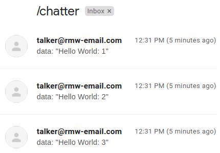
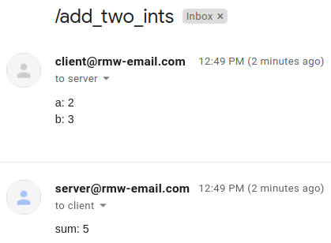

# rmw_email

[](https://github.com/christophebedard/rmw_email/tags)
[](https://github.com/christophebedard/rmw_email/actions)
[](https://github.com/christophebedard/rmw_email/blob/master/LICENSE)

ROS 2 over email.
rmw_email contains a middleware that sends & receives strings over email and an RMW implementation that allows ROS 2 to use this middleware to exchange messages.

For an overview of the motivation and process behind this project, see this blog post: [christophebedard.com/ros-2-over-email](https://christophebedard.com/ros-2-over-email/).

1. [Overview](#overview)
1. [Packages](#packages)
1. [Supported features](#supported-features)
   1. [Platform support](#platform-support)
1. [Performance](#performance)
1. [How to use](#how-to-use)
1. [Configuration](#configuration)
1. [Tracing](#tracing)
1. [Logging](#logging)
1. [`email` examples](#email-examples)

## Overview

[`rmw_email_cpp`](#packages) uses [type support introspection](https://docs.ros.org/en/rolling/Concepts/About-Internal-Interfaces.html#dynamic-type-support) to convert messages to YAML objects.
This is done for both C and C++ type supports using the [`dynmsg` package](https://github.com/christophebedard/dynamic_message_introspection/tree/add-cpp-support-and-refactor).
The YAML objects are then converted to strings.

Those strings are sent via email using the [`email` package](#packages).
The topic name is used as the email subject; the email body contains the YAML string representing the message.
Messages can therefore easily be read.

<p align="center">
   
</p>

To receive messages, this process is repeated in the opposite direction.

Successive messages on the same topic generally end up in the same email thread (depending on the client).
Service responses are email replies to the corresponding email request (this is handled by `email`).

<p align="center">
   
</p>

`email` also has an [intraprocess communication mode](#configuration) to bypass actually sending and receiving emails.

## Packages

This repository contains a few packages:

* [`email`](./email/): simple publish/subscribe & service middleware using emails to exchange strings
   * See the [API documentation](https://christophebedard.com/rmw_email/api/email/).
   * See the [design document](./email/doc/design.md) ([rendered version](https://christophebedard.com/rmw_email/design/email/)).
   * This package claims to be in the **Quality Level 4** category, see the [Quality Declaration](./email/QUALITY_DECLARATION.md) for more details.
   * 
* [`email_examples`](./email_examples/): various examples using `email`
   * See [*`email` examples*](#email-examples).
   * This package claims to be in the **Quality Level 4** category, see the [Quality Declaration](./email_examples/QUALITY_DECLARATION.md) for more details.
* [`rmw_email_cpp`](./rmw_email_cpp/): ROS 2 `rmw` implementation using `email` as the middleware
   * See [*supported features*](#supported-features).
   * This package claims to be in the **Quality Level 4** category, see the [Quality Declaration](./rmw_email_cpp/QUALITY_DECLARATION.md) for more details.
   * 

## Supported features

The following table shows the features currently supported/unsupported by `rmw_email_cpp`.

| ROS 2 feature | Status |
|---------------|--------|
| publishers/subscriptions | :heavy_check_mark: |
| services, actions | :heavy_check_mark: |
| introspection using `ros2 *` commands | :x: |
| QoS, rmw events | :x: |

### Platform support

rmw_email was primarily developed on Ubuntu.
However, it should work on macOS and Windows without too much effort.
See [REP 2000](https://www.ros.org/reps/rep-2000.html#rolling-ridley-june-2020-ongoing).

## Performance

We can use [performance_test](https://gitlab.com/ApexAI/performance_test) to compare the performance of `rmw_email_cpp` to another RMW implementation.

<p align="center">
   
</p>

See the [`perf_test.sh`](./rmw_email_cpp/perf/perf_test.sh) and [`perf_plot.sh`](./rmw_email_cpp/perf/perf_plot.py) scripts to run performance_test and generate a plot like the one above.

## How to use

1. Clone this repo into your ROS 2 workspace
   ```sh
   $ cd ~/ws/src/
   $ git clone https://github.com/christophebedard/rmw_email.git
   ```
1. Clone dependencies
   ```sh
   $ cd ~/ws/
   $ vcs import src --input https://raw.githubusercontent.com/christophebedard/rmw_email/master/dependencies.repos
   ```
1. Build
   ```sh
   $ cd ~/ws/
   $ colcon build  # ...
   ```
1. Create `email` configuration file(s) for your executable(s)  
   See [*configuration*](#configuration).
1. Use by setting the `RMW_IMPLEMENTATION` environment variable to `rmw_email_cpp` and the `EMAIL_CONFIG_FILE` environment variable to your configuration file, e.g.
   ```sh
   $ cd ~/ws/
   $ source install/setup.bash
   $ export RMW_IMPLEMENTATION=rmw_email_cpp
   $ export EMAIL_CONFIG_FILE=path/to/email.yml
   $ ros2 run demo_nodes_cpp talker
   $ # ...
   ```

## Configuration

In order to send & receive emails, a YAML configuration file has to be provided.
By default, the path to the config file is `email.yml`, relative to the current working directory.
However, the path can be changed using the `EMAIL_CONFIG_FILE` environment variable, e.g., `EMAIL_CONFIG_FILE=other/dir/myemail.yml`.
If that file does not exist, `~/email.yml` will be used as a backup if it exists.

A sample configuration file is provided: [`email.yml`](./email/email.yml).
As for the values:

   * `url-smtp`: SMTP server URL
      * for Gmail: `smtp.gmail.com`
   * `url-imap`: IMAP server URL
      * for Gmail: `imap.gmail.com`
   * `username`: your email address
   * `password`: your password
      * it is recommended to generate a "unique" password. For Gmail, that is an [app password](https://myaccount.google.com/apppasswords). Under *Select app*, click *Other (Custom name)* and simply enter something like *rmw_email*. Copy the generated password and paste it in the config file.
   * `to`/`cc`/`bcc`: recipients
      * either as simple string values or as an array of string values, e.g.:
         ```yaml
         to: my@email.com
         cc:
           - some@email.com
           - another@email.com
         ```
      * `to` must be defined and must contain at least one email address, but `cc` and `bcc` are optional
   * `polling-period`: email polling period in nanoseconds
      * optional; by default, polling will be done as fast as possible
   * `intraprocess`: enable intraprocess mode by setting to `true`
      * optional; by default, intraprocess is disabled
      * this makes `email` act as if it was sending emails to itself and entirely bypasses actually sending and receiving emails
      * all other options are optional and have no effect in practice if intraprocess is enabled

Using the same configuration file with the same email for the `username` and `to` fields (i.e., same email address for sending & receiving) for multiple executables should work.
Alternatively, you can use two different configuration files for two different executables, e.g., if they're sending emails to each other.

## Tracing

`email` has LTTng tracepoints for publishers and subscriptions.
See [`email/include/email/lttng.hpp`](./email/include/email/lttng.hpp).
Tracepoints are automatically included if LTTng is installed and detected.
To completely remove them, build with `--cmake-args -DEMAIL_ENABLE_TRACING=OFF`.

`rmw_email_cpp` supports the [`ros2_tracing`](https://gitlab.com/ros-tracing/ros2_tracing) tracepoints for the `rmw` layer.
It also has another LTTng tracepoint in order to link ROS 2 messages to `email` messages.
See [`rmw_email_cpp/include/rmw_email_cpp/lttng.hpp`](./rmw_email_cpp/include/rmw_email_cpp/lttng.hpp).
See [`ros2_tracing`'s README](https://gitlab.com/ros-tracing/ros2_tracing#building) for information on how to enable or disable tracepoints.

## Logging

There are a few logging options for `email` itself:

1. Set the console logging level through the `EMAIL_LOG_LEVEL` environment variable, e.g., `EMAIL_LOG_LEVEL=debug`.
   * The logging levels are: `off`, `debug`, `info`, `warn`, `error`, and `fatal`.
   * The default level is `info`.
1. Write all logs to a file by setting the `EMAIL_LOG_FILE` environment variable to a file path.
   * This writes all logs to the file, independently of the logging level set through `EMAIL_LOG_LEVEL`.
   * A leading `~` is expanded to the user's home directory.
1. Set the `EMAIL_CURL_VERBOSE` environment variable to be non-empty, e.g., `EMAIL_CURL_VERBOSE=y`. This will enable libcurl's verbose option.
   * Generally produces too much output to be useful.

As for `rmw_email_cpp`, simply use the [existing logging configuration options](https://docs.ros.org/en/rolling/Tutorials/Logging-and-logger-configuration.html), including:

1. [CLI option](https://docs.ros.org/en/rolling/Tutorials/Logging-and-logger-configuration.html#logger-level-configuration-command-line)
   ```sh
   $ ros2 run $pkg $exec --ros-args --log-level debug
   $ ros2 run $pkg $exec --ros-args --log-level rmw_email_cpp:=debug
   ```

## `email` examples

The [`email_examples` package](./email_examples/) contains simple examples using `email`:

* [email sender](./email_examples/src/send.cpp)
* [email receiver](./email_examples/src/receive.cpp)
* publisher
   * [simple publisher](./email_examples/src/pub.cpp)
* subscription
   * [simple subscription with busy waiting](./email_examples/src/sub.cpp)
   * [subscription using wait utilities](./email_examples/src/sub_wait.cpp)
   * [subscription using a wait set directly](./email_examples/src/sub_wait_set.cpp)
   * [subscription with message info](./email_examples/src/sub_wait_message_info.cpp)
* service client
   * [simple service client with busy waiting](./email_examples/src/service_client.cpp)
   * [service client using wait utilities](./email_examples/src/service_client_wait.cpp)
   * [service client with response info](./email_examples/src/service_client_wait_service_info.cpp)
* service server
   * [simple service server with busy waiting](./email_examples/src/service_server.cpp)
   * [service server using wait utilities](./email_examples/src/service_server_wait.cpp)
   * [service server with request info](./email_examples/src/service_server_wait_service_info.cpp)
* intraprocess (meant to be used with the [intraprocess option enabled](#configuration))
   * publisher & subscription
      * [simple publisher with a subscription with message info in the same process](./email_examples/src/intra_pub_sub_wait_message_info.cpp)
   * service client & service server
      * [service client and service server with service info in the same process](./email_examples/src/intra_service_client_server_wait_service_info.cpp)
