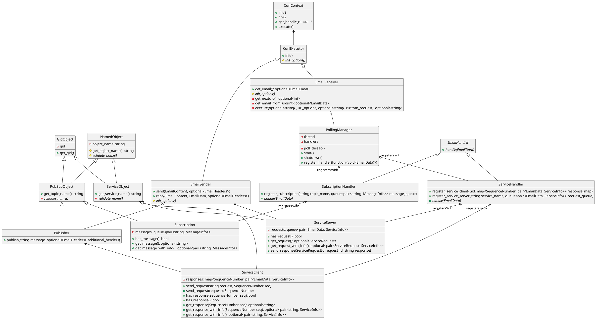
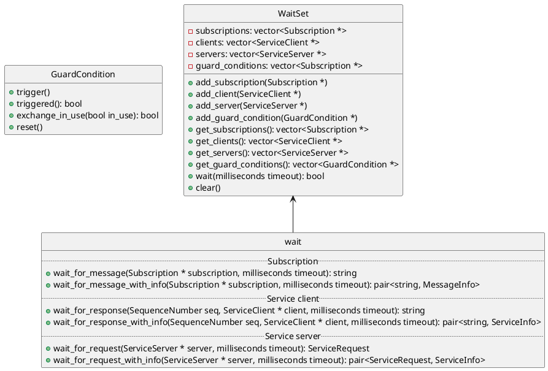
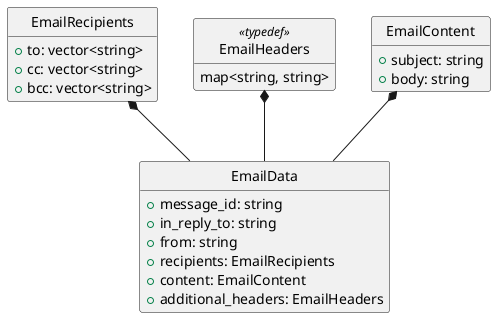
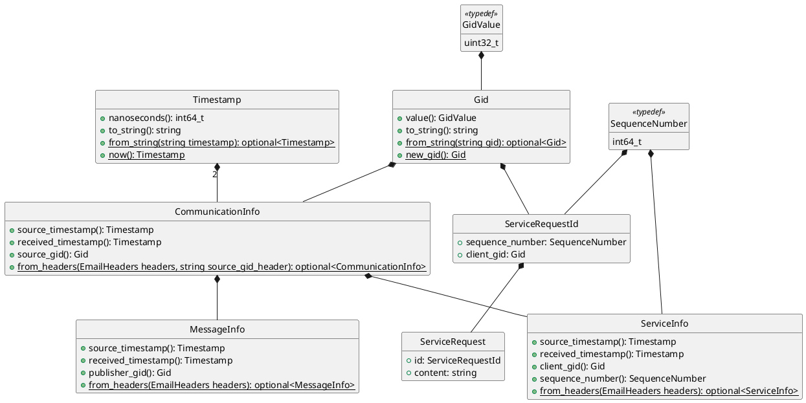

# `email` design

## Overall architecture

```plantuml
@startuml

class CurlContext {
   +init()
   +fini()
   +get_handle(): CURL *
   +execute()
}
hide CurlContext fields
hide CurlContext circle

class CurlExecutor {
   +init()
   #init_options() {abstract}
   #context: CurlContext
}
hide CurlExecutor fields
hide CurlExecutor circle
CurlContext *-- CurlExecutor


class EmailSender {
   +send(EmailContent, optional<EmailHeaders>)
   +reply(EmailContent, EmailData, optional<EmailHeaders>)
   #init_options() {abstract}
}
hide EmailSender fields
hide EmailSender circle
CurlExecutor <|-- EmailSender

class EmailReceiver {
   +get_email(): optional<EmailData>
   #init_options() {abstract}
   -get_nextuid(): optional<int>
   -get_email_from_uid(int): optional<EmailData>
   -execute(optional<string>, url_options, optional<string> custom_request): optional<string>
}
hide EmailReceiver fields
hide EmailReceiver circle
CurlExecutor <|-- EmailReceiver


class PollingManager {
   -thread
   -poll_thread()
   -handlers
   +start()
   +shutdown()
   +register_handler(function<void (EmailData)>)
}
EmailReceiver o-- PollingManager
hide PollingManager circle

abstract class EmailHandler {
   +handle(EmailData) {abstract}
}
hide EmailHandler fields
hide EmailHandler circle


class SubscriptionHandler {
   -subscriptions
   +register_subscription(string topic_name, queue<pair<string, MessageInfo>> message_queue)
   +handle(EmailData) {abstract}
}
hide SubscriptionHandler fields
hide SubscriptionHandler circle
EmailHandler <|-- SubscriptionHandler
PollingManager "registers with" <-- SubscriptionHandler

class ServiceHandler {
   -clients
   -servers
   +register_service_client(Gid, map<SequenceNumber, pair<EmailData, ServiceInfo>> response_map)
   +register_service_server(string service_name, queue<pair<EmailData, ServiceInfo>> request_queue)
   +handle(EmailData) {abstract}
}
hide ServiceHandler fields
hide ServiceHandler circle
EmailHandler <|-- ServiceHandler
PollingManager "registers with" <-- ServiceHandler


class GidObject {
   -gid
   +get_gid()
}
hide GidObject circle
class NamedObject {
   -object_name: string
   #get_object_name(): string
   #validate_name() {abstract}
}
hide NamedObject circle

class PubSubObject {
   +get_topic_name(): string
   -validate_name() {abstract}
}
hide PubSubObject fields
hide PubSubObject circle
GidObject <|-- PubSubObject
NamedObject <|-- PubSubObject

class ServiceObject {
   +get_service_name(): string
   -validate_name() {abstract}
}
hide ServiceObject fields
hide ServiceObject circle
GidObject <|-- ServiceObject
NamedObject <|-- ServiceObject


class Publisher {
   +publish(string message, optional<EmailHeaders> additional_headers)
}
hide Publisher fields
hide Publisher circle
PubSubObject <|-- Publisher
EmailSender o-- Publisher

class Subscription {
   -messages: queue<pair<string, MessageInfo>>
   +has_message(): bool
   +get_message(): optional<string>
   +get_message_with_info(): optional<pair<string, MessageInfo>>
}
hide Subscription circle
PubSubObject <|-- Subscription
SubscriptionHandler "registers with" <-- Subscription


class ServiceClient {
   -responses: map<SequenceNumber, pair<EmailData, ServiceInfo>>
   +send_request(string request, SequenceNumber seq)
   +send_request(request): SequenceNumber
   +has_response(SequenceNumber seq): bool
   +has_response(): bool
   +get_response(SequenceNumber seq): optional<string>
   +get_response_with_info(SequenceNumber seq): optional<pair<string, ServiceInfo>>
   +get_response_with_info(): optional<pair<string, ServiceInfo>>
}
hide ServiceClient circle
ServiceObject <|-- ServiceClient
Publisher *-- ServiceClient
ServiceHandler "registers with" <-- ServiceClient

class ServiceServer {
   -requests: queue<pair<EmailData, ServiceInfo>>
   +has_request(): bool
   +get_request(): optional<ServiceRequest>
   +get_request_with_info(): optional<pair<ServiceRequest, ServiceInfo>>
   +send_response(ServiceRequestId request_id, string response)
}
hide ServiceServer circle
ServiceObject <|-- ServiceServer
EmailSender *-- ServiceServer
ServiceHandler "registers with" <-- ServiceServer

@enduml
```

TODO briefly explain.

```plantuml
@startuml

class GuardCondition {
   +trigger()
   +triggered(): bool
   +exchange_in_use(bool in_use): bool
   +reset()
}
hide GuardCondition fields
hide GuardCondition circle

class WaitSet {
   -subscriptions: vector<Subscription *>
   -clients: vector<ServiceClient *>
   -servers: vector<ServiceServer *>
   -guard_conditions: vector<Subscription *>
   +add_subscription(Subscription *)
   +add_client(ServiceClient *)
   +add_server(ServiceServer *)
   +add_guard_condition(GuardCondition *)
   +get_subscriptions(): vector<Subscription *>
   +get_clients(): vector<ServiceClient *>
   +get_servers(): vector<ServiceServer *>
   +get_guard_conditions(): vector<GuardCondition *>
   +wait(milliseconds timeout): bool
   +clear()
}
hide WaitSet circle

class wait. {
   .. Subscription ..
   +wait_for_message(Subscription * subscription, milliseconds timeout): string
   +wait_for_message_with_info(Subscription * subscription, milliseconds timeout): pair<string, MessageInfo>
   .. Service client ..
   +wait_for_response(SequenceNumber seq, ServiceClient * client, milliseconds timeout): string
   +wait_for_response_with_info(SequenceNumber seq, ServiceClient * client, milliseconds timeout): pair<string, ServiceInfo>
   .. Service server ..
   +wait_for_request(ServiceServer * server, milliseconds timeout): ServiceRequest
   +wait_for_request_with_info(ServiceServer * server, milliseconds timeout): pair<ServiceRequest, ServiceInfo>
}
hide wait. circle
hide wait. fields
WaitSet <-- wait

@enduml
```

## Containers

### Email

```plantuml
@startuml

/'
class ConnectionInfo {
   +host: string
   +username: string
   +password: string
}
hide ConnectionInfo circle
hide ConnectionInfo methods

class ProtocolInfo {
   +protocol: string
   +port: int
}
hide ProtocolInfo circle
hide ProtocolInfo methods

class UserInfo {
   +host_smtp: string
   +host_imap: string
   +username: string
   +password: string
}
'/

class EmailRecipients {
   +to: vector<string>
   +cc: vector<string>
   +bcc: vector<string>
}
hide EmailRecipients circle
hide EmailRecipients methods

class EmailHeaders <<typedef>> {
   map<string, string>
}
hide EmailHeaders circle
hide EmailHeaders methods

class EmailContent {
   +subject: string
   +body: string
}
hide EmailContent circle
hide EmailContent methods

class EmailData {
   +message_id: string
   +in_reply_to: string
   +from: string
   +recipients: EmailRecipients
   +content: EmailContent
   +additional_headers: EmailHeaders
}
hide EmailData circle
hide EmailData methods
EmailRecipients *-- EmailData
EmailContent *-- EmailData
EmailHeaders *-- EmailData

@enduml
```

### Messages

```plantuml
@startuml

class Timestamp {
   +nanoseconds(): int64_t
   +to_string(): string
   +from_string(string timestamp): optional<Timestamp> {static}
   +now(): Timestamp {static}
}
hide Timestamp fields
hide Timestamp circle

class GidValue <<typedef>> {
   uint32_t
}
hide GidValue circle
hide GidValue methods
class Gid {
   +value(): GidValue
   +to_string(): string
   +from_string(string gid): optional<Gid> {static}
   +new_gid(): Gid {static}
}
hide Gid fields
hide Gid circle
GidValue *-- Gid

class SequenceNumber <<typedef>> {
   int64_t
}
hide SequenceNumber circle
hide SequenceNumber methods


class CommunicationInfo {
   +source_timestamp(): Timestamp
   +received_timestamp(): Timestamp
   +source_gid(): Gid
   +from_headers(EmailHeaders headers, string source_gid_header): optional<CommunicationInfo> {static}
}
hide CommunicationInfo fields
hide CommunicationInfo circle
Timestamp "2" *-- CommunicationInfo
Gid *-- CommunicationInfo

class MessageInfo {
   +source_timestamp(): Timestamp
   +received_timestamp(): Timestamp
   +publisher_gid(): Gid
   +from_headers(EmailHeaders headers): optional<MessageInfo> {static}
}
hide MessageInfo fields
hide MessageInfo circle
CommunicationInfo *-- MessageInfo

class ServiceInfo {
   +source_timestamp(): Timestamp
   +received_timestamp(): Timestamp
   +client_gid(): Gid
   +sequence_number(): SequenceNumber
   +from_headers(EmailHeaders headers): optional<ServiceInfo> {static}
}
hide ServiceInfo fields
hide ServiceInfo circle
CommunicationInfo *-- ServiceInfo
SequenceNumber *-- ServiceInfo

class ServiceRequestId {
   +sequence_number: SequenceNumber
   +client_gid: Gid
}
hide ServiceRequestId circle
hide ServiceRequestId methods
SequenceNumber *-- ServiceRequestId
Gid *-- ServiceRequestId

class ServiceRequest {
   +id: ServiceRequestId
   +content: string
}
hide ServiceRequest circle
hide ServiceRequest methods
ServiceRequestId *-- ServiceRequest

@enduml
```
