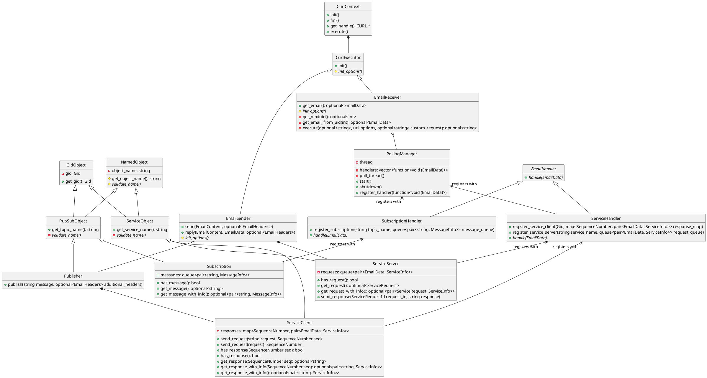
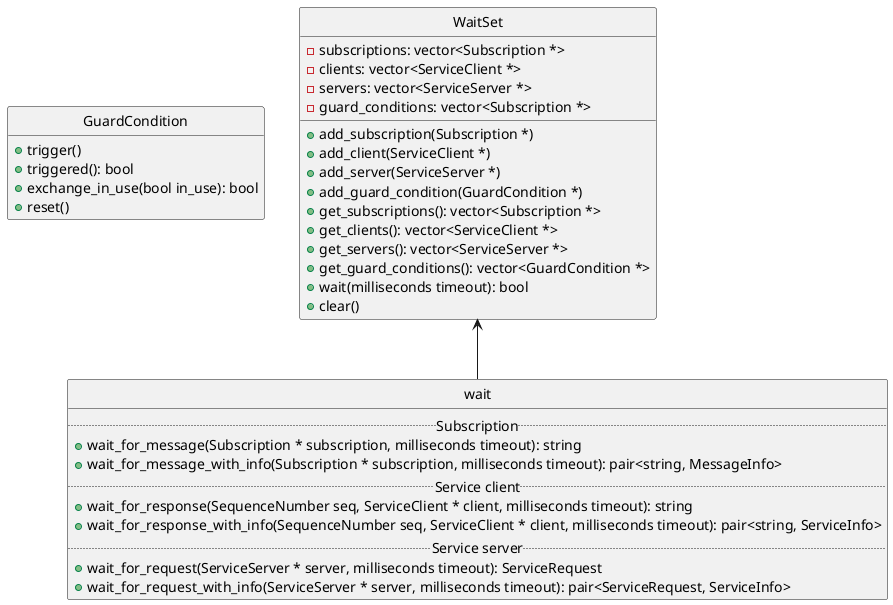
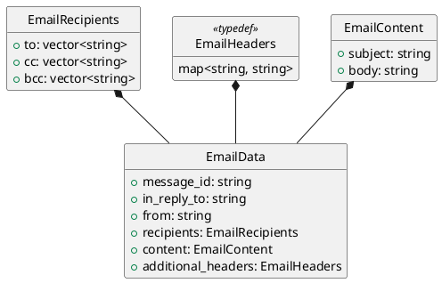
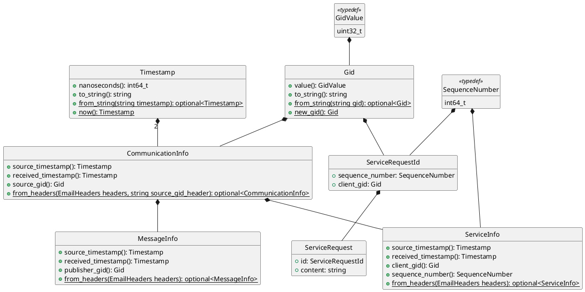

# `email` design

**Note**: for a rendered version of this document, see: https://christophebedard.com/rmw_email/design/email/

1. [Use of emails](#use-of-emails)
   1. [As a message container](#as-a-message-container)
   1. [Headers](#headers)
   1. [Polling](#polling)
1. [Overall architecture](#overall-architecture)
1. [Waiting on messages](#waiting-on-messages)
1. [Data containers](#data-containers)
   1. [Email](#email)
   1. [Messages](#messages)

## Use of emails

### As a message container

Emails are used as a container to send and receive string messages.

The email subject is used for the topic name or service name.
The email body contains the string message.

### Headers

Emails include both standard and non-standard (i.e., custom) headers.
Email headers are used to include metadata about each communication instance in a structured way without polluting the content itself (i.e., email body).
See [*Data containers*](#data-containers).
These custom headers do not have a `X-` prefix as per [RFC 6648](https://datatracker.ietf.org/doc/html/rfc6648).

This metadata is thus also used to be able to differentiate between publisher/subscription messages and service requests/responses.
See [*Overall architecture*](#overall-architecture).

The headers of the service response emails are set so that the email is a reply to the original service request email.
This is done by setting the values of the `In-Reply-To` and `References` headers of the response email to the value of the `Message-ID` header of the request email.
See [page 26 of RFC 5322](https://datatracker.ietf.org/doc/html/rfc5322#page-26).

The use of these headers also helps differentiate between a service request and a service response.

### Polling

To poll for new emails using the IMAP protocol commands, we can:

* first run an `EXAMINE INBOX` command to get the UID value of the next email
   * a UID is simply a unique identifier for each email
      * see [RFC 3501 section 2.3.1.1](https://datatracker.ietf.org/doc/html/rfc3501#section-2.3.1.1)
   * the next UID value is called `UIDNEXT` in the command response
   * see [RFC 3501 section 6.3.2](https://datatracker.ietf.org/doc/html/rfc3501#section-6.3.2) for the `EXAMINE` command and response
* then periodically try to fetch en email using that UID
   * if there is no new email, the command will fail
      * keep trying
   * if there is a new email, we increment an internal UID counter
   * then we repeat this step with this new value

## Overall architecture

There are three main layers to send and receive messages:

1. `curl`: context, executor
   * does basic `libcurl` initialization
   * connects to remote server
1. email: sender, receiver
   * uses the first layer with `libcurl` to execute commands to:
      * send emails through `smtps` (secure SMTP)
      * poll for emails through `imaps` (secure IMAP)
   * email senders can send an email that is a reply to an email received by an email receiver
   * see [*Use of emails*](#use-of-emails)
1. publisher/subscription and service client/server
   * publishers are simply email senders
   * subscriptions indirectly use email receivers
   * service clients use publishers to send requests and indirectly use email receivers to receive responses
   * service servers indirectly use email receivers to receive requests and use email senders to send responses by replying to the request email

Internal handling of emails/mesages is done as follows:

1. polling manager
   * uses an email receiver to poll for new emails on a thread
   * calls all registered handlers when a new email is received
1. handlers: subscription, service client/server
   * all handlers register with the polling manager
   * handlers check whether the new email applies to them
      * see [*Use of emails*](#use-of-emails)
   * if so, they pass it on to the right object(s) that registered with them
      * according to topic name or service name
1. subscriptions, service clients/servers
   * all subscriptions register with the subscription handler
   * all service clients and servers register with the service handler
   * new messages, service requests or service responses are added to the corresponding queues or maps
      * subscriptions have a message queue
      * service clients have a response map
      * service servers have a request queue
   * users can either poll the subscription/client/server directly for new messages/requests/responses or wait on it
      * see [*Waiting on messages*](#waiting-on-messages)

## Waiting on messages

Subscriptions and service clients/servers must be waited on through polling.
Wait sets can be used to wait on new messages, service requests or service responses.
Some utility functions can be used to wait on a specific object using a wait set.

Wait sets also support guard conditions as another way to control waiting.

## Data containers

### Email

Emails contain:

* recipients
* subject
* body
* headers (metadata)

### Messages

Basic metadata is provided for all communication instances (i.e., messages, service requests or service responses):

* source timestamp
* reception timestamp
* GID of the source object (i.e., publisher, service client or service server)
   * a GID is just a unique identifier

Additionally, for service requests/responses:

* sequence number of the request
   * for service responses, this is the sequence number of the original request

